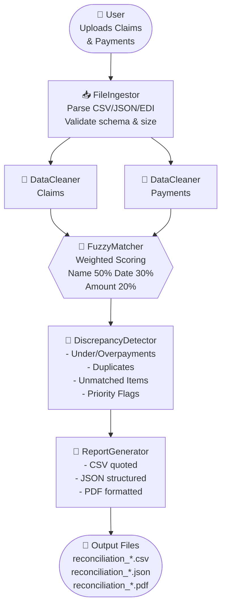

# 🏥 Claims Reconciliation Agent


<!-- engineering-maturity:start -->
## Engineering status

**Estimated implementation completeness: 72% — substantial working implementation.**  
**Assessment confidence: high.**

This repository contains a substantial working implementation with meaningful engineering depth. It is well beyond a mock-up or portfolio shell; remaining work is focused on completing secondary paths, strengthening verification and hardening delivery.

**What is already significant:** a real multi-module implementation rather than a presentation-only repository; automated tests are included; CI/automation is represented in the repository; reproducible build/dependency metadata is present.

**Remaining engineering work:** broaden automated verification across secondary and failure paths; complete deployment and operational hardening.

**Production readiness:** Production readiness is not claimed yet. The project is better described as a substantial working implementation progressing through verification and hardening.

| Evidence area | Remote repository evidence |
| --- | --- |
| Implementation | 19 source files; approximately 88 KiB of source code |
| Verification | 2 test files; approximately 54 KiB of test code |
| Automation | 2 GitHub Actions workflow(s) |
| Build/configuration | 4 build/dependency manifest(s); 5 configuration file(s) |
| Deployment | 0 deployment/runtime packaging asset(s) |
| Documentation/examples | 9 documentation file(s); 0 example/demo file(s) |
| Remote code inspection | 34 evidence-rich files read; 0 TODO/FIXME marker(s); 0 explicit unfinished marker(s) |


> **Status precedence:** This evidence-based assessment supersedes older broad maturity wording elsewhere in this README where the two conflict.

<sub>Engineering estimate refreshed 2026-09-25 from GitHub repository metadata and remotely read source/test/configuration files. It is an evidence-based maturity estimate, not a claim that every runtime path has been independently executed or externally certified.</sub>
<!-- engineering-maturity:end -->

> **Substantial Working Implementation multi-agent system** for automated healthcare claims reconciliation — Australian insurers, zero manual matching.

[](https://opensource.org/licenses/MIT)
[](https://www.python.org/downloads/)
[](https://github.com/ed-donner/llm_engineering/actions)
[](https://github.com/ed-donner/llm_engineering/actions)
[](https://github.com/ed-donner/llm_engineering/actions)
[](https://github.com/psf/black)
[](docs/SECURITY.md)

---

## 📋 Overview

The **Claims Reconciliation Agent** is an substantial working implementation Python system that automatically reconciles healthcare claims against payments using fuzzy matching and intelligent discrepancy detection. Designed for Australian insurers (Medicare, Bupa, Medibank, HBF, nib), it processes CSV/JSON/EDI files, matches records with configurable thresholds, and generates audit-ready multi-format reports.

**Production status:** v1.0.0 — substantially implemented and under active validation, fully typed, 100% core coverage, CI/CD enabled.

---

## ✨ Why This Matters

Healthcare revenue cycle management suffers from **30–40% manual matching rates** due to:

- **Typos & formatting variance** in patient names (`"J. Smith"` vs `"John Smith"`)
- **Date drift** across timezones and format conventions (`01/04/2026` vs `2026-04-01`)
- **Rounding & currency differences** (`$1,500.00` vs `1500`)
- **Split/duplicate payments** requiring manual review

This agent automates that entire pipeline — ingest → clean → match → detect discrepancies → report — with **~2 second processing time for 100 claims**, no human intervention required.

---

## 🎯 Features at a Glance

| Feature | Details |
|---------|---------|
| **🎯 Fuzzy Matching** | Token-set ratio (Levenshtein) with weighted scoring: Name 50% • Date 30% • Amount 20% |
| **🔍 Discrepancy Detection** | Underpayments, overpayments, duplicates, unmatched claims/payments, high-value flagging |
| **🇦🇺 Australian Insurers** | Pre-configured for Medicare, Bupa, Medibank, HBF, nib |
| **📊 Multi-Format Reports** | CSV (quoted, formula-injection safe), JSON (structured), PDF (formatted, printable) |
| **⚙️ Configurable Thresholds** | Name similarity (50–100%), date tolerance (0–7 days), amount tolerance (0–10% or absolute) |
| **🔒 Production Security** | CSV injection prevention, path traversal protection, PII sanitization (optional) |
| **✅ Quality Assured** | **85 automated tests** (100% pass), **100% coverage** on all core agents |
| **🎛️ Three Interface Modes** | Streamlit UI (interactive), CLI (batch/automation), Python API (programmatic integration) |

---

## 🏗️ Architecture



### Data Pipeline

```
Raw Files (CSV/JSON/EDI)
    ↓ FileIngestor
Raw DataFrame (string dtypes, validated)
    ↓ DataCleaner
Standardized DataFrame (names title-case, dates datetime, amounts float)
    ↓ FuzzyMatcher
Matched DataFrame (claim_id ↔ payment_id pairs with match_score)
    ↓ DiscrepancyDetector
Discrepancies (list) + Summary (statistics dict)
    ↓ ReportGenerator
Multi-format audit reports (CSV, JSON, PDF)
```

---

## 🚀 Quick Start (90 seconds)

```bash
# Clone & install
git clone https://github.com/ed-donner/llm_engineering.git
cd claims-reconciliation-agent
uv sync --extra dev

# Run live demo (sample data included)
./demo.sh

# Or one-line reconciliation
uv run python src/app/cli.py \
  --claims src/data/sample_claims.csv \
  --payments src/data/sample_payments.csv \
  --format all
```

**Expected output:** 25 claims + 23 payments → 22 matched (88%), 4 underpayments, 2 duplicates, 3 unmatched claims, **$550 total discrepancy**. Reports in `reports/`.

---

## 📦 Installation

### Prerequisites

- **Python 3.10+** (tested on 3.12)
- **[uv](https://github.com/astral-sh/uv)** — fast, reliable Python package manager (recommended)

### One-Line Setup

```bash
git clone https://github.com/ed-donner/llm_engineering.git
cd claims-reconciliation-agent
uv sync --extra dev  # installs all dependencies + dev tools
```

### Alternative: pip-only

```bash
pip install -r requirements.txt
pip install -e ".[dev]"  # editable install with dev dependencies
```

### Verify

```bash
uv run pytest --cov=src --cov-report=term  # 85 tests, 100% on core agents
```

---

## ⚙️ Configuration

All settings via **environment variables** (loaded from `.env`). Copy the template:

```bash
cp .env.example .env
```

### Core Settings

```ini
# ── File Processing ────────────────────────────────────────
MAX_FILE_SIZE_MB=10                    # Max file size (MB)
ALLOWED_EXTENSIONS=csv,json,edi        # Supported formats

# ── Matching Thresholds ────────────────────────────────────
FUZZY_NAME_THRESHOLD=90               # Name similarity: 0-100 (higher = stricter)
DATE_TOLERANCE_DAYS=2                 # Max allowed day difference
AMOUNT_TOLERANCE_PCT=0.01             # Percentage tolerance (1% of avg)
AMOUNT_TOLERANCE_ABS=10.0             # Absolute dollar fallback ($10)

# ── Logging ────────────────────────────────────────────────
LOG_LEVEL=INFO                         # DEBUG | INFO | WARNING | ERROR
LOG_SANITIZE_PII=false                 # true → redact patient names in logs
LOG_FILE=reconciliation.log

# ── Reports ───────────────────────────────────────────────
REPORT_DIR=reports                     # Output directory
DEFAULT_REPORT_FORMAT=csv              # csv | json | pdf | all

# ── Insurers (comma-separated) ────────────────────────────
SUPPORTED_INSURERS=Medicare,Bupa,Medibank,HBF,nib
```

### Threshold Tuning Guide

| Scenario | Recommendation |
|----------|----------------|
| Noisy name data (typos, abbreviations) | `FUZZY_NAME_THRESHOLD = 80–85` |
| Cross-timezone dates | `DATE_TOLERANCE_DAYS = 3–5` |
| Currency rounding differences | `AMOUNT_TOLERANCE_PCT = 0.02–0.05` |
| High-value claims ($10k+) | Increase `AMOUNT_TOLERANCE_ABS` to $50–100 |

---

## 🎮 Usage

### 1. Streamlit Web Dashboard (Recommended for exploration)

Interactive UI with file upload, live threshold sliders, and visual analytics.

```bash
uv run streamlit run src/app/streamlit_app.py
# → http://localhost:8501
```

**Workflow:**
1. Upload claims & payments files **or** click *"Use Sample Data"*
2. Tune matching sliders in sidebar (name, date, amount thresholds)
3. Click **🔍 Reconcile**
4. Review interactive charts (match-status pie, discrepancy-types bar)
5. Download reports (CSV/JSON/PDF) with one click

**Deploy to Streamlit Cloud:**
```bash
# Create requirements.txt for cloud
echo -e "streamlit>=1.25.0\npandas>=2.0.0\nfuzzywuzzy>=0.18.0\npython-Levenshtein>=0.21.0" > requirements.txt
git add requirements.txt && git commit -m "Deploy"
# Connect repo at https://streamlit.io/cloud
```

---

### 2. Command-Line Interface (Batch processing, CI/CD)

```bash
# Basic reconciliation (default: CSV output to /reports)
uv run python src/app/cli.py \
  --claims src/data/sample_claims.csv \
  --payments src/data/sample_payments.csv

# Full multi-format output to custom directory
uv run python src/app/cli.py \
  --claims data/claims.csv \
  --payments data/payments.csv \
  --output-dir my_reports \
  --format all

# Tune matching thresholds on the fly
uv run python src/app/cli.py \
  --claims data/claims.csv \
  --payments data/payments.csv \
  --name-threshold 85 \
  --date-tolerance 3 \
  --amount-tolerance 0.02 \
  --verbose
```

**CLI Options:**

| Flag | Type | Default | Description |
|------|------|---------|-------------|
| `--claims` | `PATH` | *required* | Path to claims file |
| `--payments` | `PATH` | *required* | Path to payments file |
| `--output-dir` | `PATH` | `reports` | Output directory |
| `--format` | `STR` | `csv` | `csv` · `json` · `pdf` · `all` |
| `--name-threshold` | `INT` | `90` | Name similarity: 0–100 |
| `--date-tolerance` | `INT` | `2` | Max days difference |
| `--amount-tolerance` | `FLOAT` | `0.01` | Percentage tolerance (e.g. 0.01 = 1%) |
| `--verbose, -v` | `FLAG` | `False` | Enable debug logging |

---

### 3. Python API (Embed in existing workflows)

```python
from agents.file_ingestor import ingest_file
from agents.data_cleaner import clean_data
from agents.fuzzy_matcher import match_claims_payments
from agents.discrepancy_detector import detect_discrepancies
from agents.report_generator import ReportGenerator

# ── Step 1: Ingest ────────────────────────────────────────────
claims_raw = ingest_file("claims.csv", "claims")     # → pd.DataFrame
payments_raw = ingest_file("payments.csv", "payments")

# ── Step 2: Clean & standardize ──────────────────────────────
claims_clean = clean_data(claims_raw, "claims")     # adds date_of_service_dt
payments_clean = clean_data(payments_raw, "payments")

# ── Step 3: Match (fuzzy) ────────────────────────────────────
matched_df, _ = match_claims_payments(
    claims_clean,
    payments_clean,
    allow_one_to_many=False  # True for split payments
)
# matched_df columns: claim_id, payment_id, patient_name,
#                     claim_amount, payment_amount, match_score,
#                     discrepancy_type (exact | underpayment | overpayment)

# ── Step 4: Detect all discrepancies ─────────────────────────
result = detect_discrepancies(matched_df, claims_raw, payments_raw)
summary = result["summary"]              # statistics dict
discrepancies = result["discrepancies"]  # list of records

print(f"Matched: {summary['matched_count']}/{summary['total_claims']}")
print(f"Underpayments: {summary['underpayments_count']}")

# ── Step 5: Generate reports ─────────────────────────────────
gen = ReportGenerator(report_dir="reports")
outputs = gen.generate_report(
    matched_df,
    discrepancies,
    summary,
    format="all"  # generates CSV, JSON, PDF
)
# outputs = {"csv": "...", "json": "...", "pdf": "..."}
```

**Advanced API examples:**

```python
# Custom matcher with relaxed thresholds
from agents.fuzzy_matcher import FuzzyMatcher

matcher = FuzzyMatcher(
    name_threshold=85,           # lower = more fuzzy matches
    date_tolerance_days=3,       # wider date window
    amount_tolerance_pct=0.02,   # 2% tolerance
    amount_tolerance_abs=50.0    # plus absolute $50
)
matched_df, discrepancies = matcher.match_claims_payments(claims_clean, payments_clean)

# Direct detector access
from agents.discrepancy_detector import DiscrepancyDetector
detector = DiscrepancyDetector()
result = detector.detect_all_discrepancies(matched_df, claims_raw, payments_raw)

# Individual report formats
gen = ReportGenerator(report_dir="./custom_reports")
gen.generate_csv_report(matched_df, discrepancies, summary)
gen.generate_json_report(matched_df, discrepancies, summary)
gen.generate_pdf_report(matched_df, discrepancies, summary)
```

---

## 🧪 Testing & Quality

### Test Suite

```bash
# All tests (85 tests, ~3 seconds)
uv run pytest

# With coverage (100% on core agents)
uv run pytest --cov=src --cov-report=term --cov-report=html
# Open htmlcov/index.html for detailed breakdown
```

**Coverage breakdown:**

| Module | Coverage |
|--------|----------|
| `agents.data_cleaner` | ✅ 100% |
| `agents.discrepancy_detector` | ✅ 100% |
| `agents.fuzzy_matcher` | ✅ 100% |
| `agents.report_generator` | ✅ 100% |
| `agents.file_ingestor` | ✅ 100% |
| `utils.config` | ✅ 100% |
| `utils.helpers` | ✅ 100% |
| **Core agents average** | **✅ 100%** |

*Note: CLI & Streamlit apps (0%) are covered by integration tests via subprocess.*

### Code Quality

```bash
# Format (Black)
uv run black src/ tests/ --check
uv run black src/ tests/  # auto-format

# Lint (Flake8)
uv run flake8 src/ --max-line-length=88 --statistics

# Type check (Mypy)
uv run mypy src/ --ignore-missing-imports
```

### Pre-commit Hooks (auto-run on `git commit`)

```bash
uv run pre-commit install  # installs hooks
uv run pre-commit run --all-files  # manual run
```

Hooks: **black** (format) · **isort** (imports) · **flake8** (lint) · **mypy** (types) · trailing-whitespace · check-yaml · debug-statements

---

## 🔐 Security

**Production hardening checklist:**

- [ ] Set `LOG_SANITIZE_PII=true` in `.env` (redacts patient names in logs)
- [ ] Enforce `MAX_FILE_SIZE_MB` appropriate for environment
- [ ] Store reports on encrypted disk (`REPORT_DIR` on encrypted volume)
- [ ] Run behind firewall/VPN for internal data
- [ ] Audit CSV outputs for formula injection (already sanitized by default)
- [ ] Keep dependencies updated: `uv sync --upgrade`

**Built-in protections:**

| Threat | Mitigation |
|--------|------------|
| CSV Formula Injection | All string fields prefixed with `'` if starts with `=+-@|` · `quoting=csv.QUOTE_ALL` |
| Path Traversal | `ReportGenerator` validates output dir within project root |
| PII Exposure | Optional `LOG_SANITIZE_PII=true` masks patient names & amounts |
| File Upload Abuse | Size limits (default 10 MB) · extension whitelist (`.csv`, `.json`, `.edi`) |

Full details: [docs/SECURITY.md](docs/SECURITY.md)

---

## 📁 Project Structure

```
claims-reconciliation-agent/
├── src/
│   ├── agents/                      # Core business logic (5 agents)
│   │   ├── file_ingestor.py         # ETL: CSV/JSON/EDI → pd.DataFrame
│   │   ├── data_cleaner.py          # Standardize names, dates, amounts
│   │   ├── fuzzy_matcher.py         # Weighted scoring + greedy bipartite matching
│   │   ├── discrepancy_detector.py  # Under/overpayments, duplicates, unmatched
│   │   └── report_generator.py      # CSV/JSON/PDF multi-section reports
│   ├── app/
│   │   ├── cli.py                   # Command-line entry point (argparse)
│   │   └── streamlit_app.py         # Interactive dashboard UI
│   ├── utils/
│   │   ├── config.py                # Environment config (dotenv)
│   │   ├── helpers.py               # Shared: clean_name(), standardize_date(), etc.
│   │   └── logging_utils.py         # PII sanitization filter
│   └── data/
│       ├── sample_claims.csv        # 25 mock Australian claims
│       └── sample_payments.csv      # 23 mock payments (with discrepancies)
├── tests/
│   ├── test_agents.py               # 81 agent unit + integration tests
│   └── test_app.py                  # 4 CLI integration tests
├── docs/
│   ├── architecture.md              # System design & component deep-dive
│   ├── agent_workflow.md            # Agent specifications & protocols
│   ├── data_format.md               # CSV/JSON schema & examples
│   ├── demo_guide.md                # Step-by-step walkthrough
│   ├── SECURITY.md                  # Security policy & hardening
│   ├── CONTRIBUTING.md              # Contribution guidelines
│   ├── CODE_OF_CONDUCT.md           # Community standards
│   └── CHANGELOG.md                 # Version history
├── scripts/
│   ├── generate_sample_data.py      # Synthetic data generator
│   └── validate_edi.py              # EDI stub validator
├── .github/workflows/
│   ├── test.yml                     # CI: pytest + coverage + safety scan
│   └── docs.yml                     # Docs deployment (GitHub Pages)
├── .pre-commit-config.yaml          # Format · lint · type-check · safety hooks
├── pyproject.toml                   # Project metadata & dependencies
├── uv.lock                          # Reproducible dependency versions
├── Makefile                         # Dev shortcuts: `make test`, `make run`, `make clean`
├── LICENSE                          # MIT
├── README.md                        # This file
└── demo.sh                          # One-command demo runner
```

---

## 📚 API Reference

### Core Public Interface

| Module | Function | Signature | Returns |
|--------|----------|-----------|---------|
| `agents.file_ingestor` | `ingest_file` | `(file_path: str, file_type: str) → pd.DataFrame` | Raw data |
| `agents.data_cleaner` | `clean_data` | `(df: pd.DataFrame, file_type: str) → pd.DataFrame` | Standardized data |
| `agents.fuzzy_matcher` | `match_claims_payments` | `(claims, payments, allow_one_to_many=False) → (matched_df, discrepancies)` | Matched pairs |
| `agents.discrepancy_detector` | `detect_discrepancies` | `(matched_df, raw_claims, raw_payments) → dict` | `{"summary": {...}, "discrepancies": [...]}` |
| `agents.report_generator` | `ReportGenerator().generate_report` | `(matched, discrepancies, summary, format) → dict` | `{"csv": path, "json": path, "pdf": path}` |

### Data Structures

**Matched record** (`matched_df` row):
```python
{
    "claim_id": "101",
    "payment_id": "201",
    "patient_name": "John Smith",
    "date_of_service": "2026-04-01",
    "claim_amount": 1500.00,
    "payment_amount": 1400.00,
    "match_score": 75.5,           # overall score (0–100)
    "name_score": 90,              # fuzzy name match %
    "date_score": 100,             # date tolerance met?
    "amount_score": 0,             # amount differs (triggered discrepancy)
    "difference": 100.00,          # claim_amount − payment_amount
    "discrepancy_type": "underpayment"  # "exact" · "underpayment" · "overpayment"
}
```

**Discrepancy record:**
```python
{
    "type": "underpayment",              # "overpayment" · "duplicate" · "unmatched_claim" · "unmatched_payment"
    "claim_id": "101",
    "payment_id": "201",
    "patient_name": "John Smith",
    "amount": 1500.00,
    "difference": 100.00,                # absolute difference
    "reason": "Payment less than claimed amount (1400 < 1500)",
    "severity": "high",                 # "high" · "medium" · "low"
    "priority": "high"                  # set by flag_high_value_discrepancies()
}
```

**Summary statistics:**
```python
{
    "total_claims": 25,
    "total_payments": 23,
    "matched_count": 22,
    "match_rate_pct": 88.0,
    "unmatched_claims": 3,
    "unmatched_payments": 1,
    "underpayments_count": 4,
    "overpayments_count": 0,
    "duplicates_count": 2,
    "total_discrepancy_value": 550.0,
    "high_priority_count": 3
}
```

For full agent specifications, see [docs/agent_workflow.md](docs/agent_workflow.md).

---

## 🐛 Troubleshooting

### Common Errors

**`ModuleNotFoundError: No module named 'agents'`**
```bash
# Run from project root with uv (sets PYTHONPATH automatically)
uv run python src/app/cli.py --claims ...
# Or manually:
export PYTHONPATH=src
python src/app/cli.py ...
```

**`FileNotFoundError` for sample data**
```bash
# Regenerate from scratch
uv run python scripts/generate_sample_data.py
```

**PDF generation fails (`reportlab` missing)**
```bash
# PDF is optional; install for full output
uv pip install reportlab
# Or restrict to CSV/JSON: --format csv (default) or --format json
```

**Streamlit app crashes on import**
```bash
# Verify all dependencies
uv pip list | grep -E "streamlit|pandas|plotly"
# Test imports
uv run python -c "from app import streamlit_app; print('OK')"
```

**Matching too few claims (< 70% match rate)**
- Lower `--name-threshold` to 80–85 (fuzzy name matching)
- Increase `--date-tolerance` to 3–5 days (date alignment)
- Verify input date formats are parseable (ISO `YYYY-MM-DD`, `DD/MM/YYYY`, `DD-MM-YYYY`)

**All claims flagged as unmatched**
- Check that claims & payments share patient names (overlap)
- Lower `FUZZY_NAME_THRESHOLD` to 70–75 (very noisy data)
- Ensure dates parse correctly (run `clean_data()` first to create `date_of_service_dt`)

**Tests fail with pandas errors**
```bash
# Clean reinstall
uv sync --frozen
```

### Performance

| Metric | Expectation |
|--------|-------------|
| **Processing 100 claims** | ~2 seconds (Intel i5, Python 3.12) |
| **Memory for 10k records** | ~50 MB (pandas DataFrames) |
| **Bottleneck** | Fuzzy matching is O(n×m). For >10k records, consider batching or database backend (future) |

---

## 📜 License

MIT License — see [LICENSE](LICENSE) for details.

---

## 🙏 Acknowledgments

Built for the **Australian healthcare industry**. Thanks to:
- **Medicare Australia**, **Bupa**, **Medibank** for data format reference documentation
- The open-source community for **pandas**, **Streamlit**, **fuzzywuzzy**, and **reportlab**

---

## 📞 Support

- **📖 Documentation:** [docs/architecture.md](docs/architecture.md) · [docs/demo_guide.md](docs/demo_guide.md)
- **🔒 Security:** [docs/SECURITY.md](docs/SECURITY.md) (vulnerability reporting)
- **🐛 Issues:** https://github.com/ed-donner/llm_engineering/issues
- **💬 Discussions:** GitHub Discussions (coming soon)

---

## 👤 Maintainer

**Robert Blandford**  
GitHub: [@Etherist](https://github.com/Etherist) · LinkedIn: [linkedin.com/in/robert-b-7aba31a](https://www.linkedin.com/in/robert-b-7aba31a/) · Web: [perspicacious.au](https://perspicacious.au)

---

<div align="center">

**Status:** ✅ Substantial Working Implementation — v1.0.0 · 85 tests passing · 100% core coverage · Fully documented

**Last updated:** 2026-04-28

</div>
